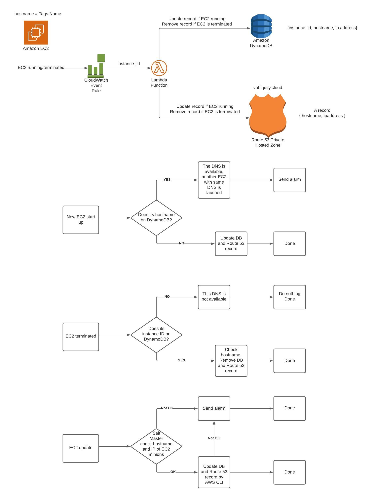

# Dynamic DNS
## Using CloudWatch Event EC2 Notification triggering Lambda function to update Private IP address as an A record to Route 53 Private Zone, also update to DynamoDB record.

## The solution 
1. Creating Infrasture using Terraform: Route 53 Private Zone, CloudWatch Event, Lambda function, DynamoDB.
3. Using CloudWatch Event EC2 Notification - Running triggering Lambda function to update Private IP address as an A record to Route 53 Private Zone, also update to DynamoDB record.
4. Using CloudWatch Event EC2 Notification - Terminated triggering Lambda function to remove Private IP address from Route 53 Private Hosted Zone, also remove to DynamoDB record.
